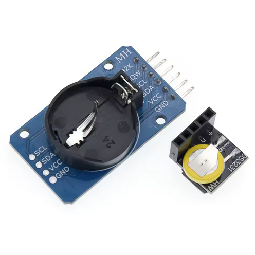

# DS3231 RTC Module — Connection Guide

The DS3231 Real-Time Clock module enables TOTP code generation in Offline and AP modes without internet access. It provides accurate timekeeping with battery backup, allowing the device to maintain time even when powered off.

---

## Why use an RTC module

**TOTP codes require accurate time.** In WiFi Client mode, the device syncs time automatically via NTP. In Offline and AP modes, there is no internet connection — the DS3231 RTC module acts as a hardware clock to keep time running.

**Without RTC:** TOTP shows "NOT SYNCED" in Offline/AP modes. Only HOTP codes and passwords work.  
**With RTC:** Full TOTP functionality in all network modes. Time persists across reboots and power loss.

---

## Compatible modules

The device uses the **DS3231** chip via I2C communication. Both compact and full-size modules work identically — choose based on your space and battery backup needs.



| Module type | Size | Battery backup | Use case |
|-------------|------|----------------|----------|
| Compact (left) | ~25×25mm | CR2032 coin cell | Portable builds, minimal space |
| Full-size (right) | ~38×22mm | CR2032 coin cell | Easier soldering, more stable mounting |

Both modules include:
- DS3231 high-precision RTC chip (±2 ppm accuracy)
- I2C interface (SDA, SCL)
- 3.3V operation
- Battery backup socket (battery not always included — check before ordering)

> **Battery backup:** The CR2032 coin cell keeps the RTC running when the device is powered off. Without it, time resets on every reboot and must be re-synced via the web cabinet.

---

## Wiring

Connect the RTC module to the device I2C pins. **Use 3.3V power** — the DS3231 operates at 3.3V and connecting to 5V may damage the module or device.

### T-Display ESP32 (classic)

| RTC Module Pin | ESP32 Pin | Description |
|----------------|-----------|-------------|
| VCC | 3.3V | Power supply |
| GND | GND | Ground |
| SDA | GPIO 21 | I2C data line |
| SCL | GPIO 22 | I2C clock line |

### T-Display-S3

| RTC Module Pin | S3 Pin | Description |
|----------------|--------|-------------|
| VCC | 3.3V | Power supply |
| GND | GND | Ground |
| SDA | GPIO 43 | I2C data line |
| SCL | GPIO 44 | I2C clock line |

> **Note:** Some RTC modules have additional pins (32K, SQW, RST) — leave them unconnected. Only VCC, GND, SDA, and SCL are required.

### Wiring diagram (ASCII)

```
┌─────────────────┐          ┌──────────────┐
│   T-Display     │          │  DS3231 RTC  │
│                 │          │              │
│  3.3V ●─────────┼──────────┼─● VCC        │
│  GND  ●─────────┼──────────┼─● GND        │
│  SDA  ●─────────┼──────────┼─● SDA        │
│  SCL  ●─────────┼──────────┼─● SCL        │
│                 │          │              │
└─────────────────┘          └──────────────┘
```

---

## Enabling RTC in firmware

The RTC module is **disabled by default** to save power. Enable it before first use:

1. Connect to the device web cabinet (AP mode or WiFi Client mode)
2. Navigate to **Display Settings**
3. Find the **DS3231 RTC** section
4. Toggle **Enable DS3231 RTC** to ON
5. Click **Sync & Save** — the device reads the current time from your browser and writes it to the RTC
6. Reboot the device

After reboot, the device will use the RTC for timekeeping in all modes. TOTP codes will work immediately in Offline and AP modes.

> **First-time sync:** The RTC has no time set from the factory. Always sync time via the web cabinet after enabling the module. The sync uses your browser's clock as the time source — ensure your computer time is accurate.

---

## Time synchronization

| Network Mode | Time Source | Sync Method |
|--------------|-------------|-------------|
| WiFi Client | NTP (internet) | Automatic on boot and hourly |
| AP Mode | DS3231 RTC | Manual via web cabinet (Display Settings → DS3231 RTC → Sync & Save) |
| Offline | DS3231 RTC | Manual via web cabinet (switch to AP mode temporarily) |

**RTC drift:** The DS3231 is highly accurate (±2 ppm = ~1 minute per year). For critical applications, re-sync time every few months via the web cabinet.

**Battery replacement:** When replacing the CR2032 battery, time is preserved if the device remains powered. If both main power and battery are removed, time resets — re-sync via web cabinet after battery replacement.

---

## Troubleshooting

| Issue | Likely Cause | Fix |
|-------|-------------|-----|
| TOTP shows "NOT SYNCED" | RTC not enabled in settings | Enable DS3231 RTC in web cabinet → Display Settings |
| TOTP shows "NOT SYNCED" after enabling | RTC not detected on I2C bus | Check wiring (SDA, SCL, VCC, GND). Verify module is powered (3.3V, not 5V) |
| Time resets on every reboot | No battery in RTC module, or RTC not enabled | Insert CR2032 battery into RTC module. Enable RTC in web cabinet |
| Time is incorrect | RTC never synced, or synced with wrong time | Sync time via web cabinet (Display Settings → DS3231 RTC → Sync & Save). Ensure computer time is correct |
| RTC detected but time doesn't update | RTC enabled but never synced | Sync time via web cabinet — RTC has no time set from factory |

> **I2C address:** The DS3231 uses I2C address `0x68`. If another I2C device on the same bus uses this address, conflicts may occur. The device firmware scans for the RTC at boot — check serial logs for detection messages.

---

## Purchasing recommendations

When buying a DS3231 RTC module:

- ✅ Verify it includes the DS3231 chip (not DS1307 — less accurate and lacks temperature compensation)
- ✅ Check if CR2032 battery is included (often sold separately)
- ✅ Confirm 3.3V operation (most modules support both 3.3V and 5V)
- ✅ Look for modules with mounting holes if you plan to secure it inside an enclosure

**Where to buy:** AliExpress, Amazon, eBay, Adafruit, SparkFun. Search for "DS3231 RTC module" or "DS3231 I2C RTC".

**Price range:** $1–5 USD depending on size and seller.

---

## Summary

1. **Buy** a DS3231 RTC module (compact or full-size)
2. **Wire** it to I2C pins (GPIO 21/22 on ESP32, GPIO 43/44 on S3) using 3.3V power
3. **Enable** the RTC in web cabinet → Display Settings
4. **Sync** time via web cabinet (Sync & Save button)
5. **Reboot** — TOTP codes now work in all network modes

The RTC module is optional but highly recommended for users who need TOTP codes without WiFi connectivity.
